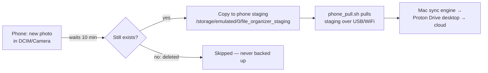

# File Organizer v2

> **⚠️ WARNING — USE AT YOUR OWN RISK ⚠️**
>
> This tool copies, synchronizes, and can DELETE files across your system.
> - Always keep current backups
> - Start in **test mode** and review logs before using real data
> - Review your `config.yaml` carefully
> - Folder sync and deduplication can delete real files when misconfigured
> - No warranty is provided — see LICENSE

---

## Overview

File Organizer has four main capabilities:

- **Organization**: Scans your files and creates a tree of **soft links** under `output_base` (e.g. `~/organized/`), grouped by type, year, and discovered content categories. **Original files stay where they are.**
- **Folder Sync**: Bidirectionally or one-way synchronizes configured folder pairs (e.g. main drive ↔ Proton Drive, main drive → external backup).
- **Deduplication**: Optionally finds and removes **duplicate real files** under configured `source_folders` by content hash.
- **Auto Git**: Optionally initializes git repositories in development folders that don't have one yet.

There are two primary ways to use it:

- **Management script** (`./manage_organizer.sh`) — recommended; wraps all modes with start/stop/status commands.
- **Command line** (`python3 -m file_organizer ...`) — for advanced use.
- **Desktop app** (`./manage_organizer.sh gui`) — Tkinter-based GUI.

---

## What's New in v2

| v1 (file_organiser) | v2 (file_organizer) |
|---------------------|---------------------|
| Categories included trivial words like `ready`, `wrote`, `that` | 610 stopwords + 1,369 common English words filtered + TF-IDF scoring (`df × log(N/df)²`) — distinctive words like `yugoslavia` outrank generic ones like `otherwise` |
| `.git` folders were moved to `~/organised` and softlinked — **broke git** | `.git`, `.hg`, `.svn` simply excluded from sync |
| `.venv`/`node_modules` softlinked during sync | Excluded from sync — reproducible from lock files. Tool reminds you to `pip freeze` if `requirements.txt` is missing |
| Custom file-copy sync logic | Native `rsync` with checksum/size-only modes. Folder sync runs in background thread — organize step returns in ~30s |
| Single monolithic file | Modular package: `config`, `scanner`, `analyzer`, `organizer`, `sync_engine`, `softlink_handler`, `auto_git`, `dedup` |

---

## Quick Start

```bash
cd /path/to/file_organizer

# 1. Create test environment with sample files
./manage_organizer.sh create-test

# 2. Dry run (safe — only creates soft links under test/organized/)
./manage_organizer.sh test

# 3. Review the output
ls -la test/organized/

# 4. Run for real (one cycle)
./manage_organizer.sh test-real

# Or wipe everything and do a fresh scan:
./manage_organizer.sh clean
```

---

## Management Script Reference

```bash
./manage_organizer.sh {command}
```

| Command | What it does |
|---------|-------------|
| `start` | Start daemon in background (production mode, continuous) |
| `stop` | Stop all file_organizer processes |
| `restart` | Stop then start |
| `status` | Check if daemon is running |
| `log` | Tail the log file (`~/.file_organizer.log`) |
| `test` | Single dry-run scan (test mode — no real files touched) |
| `test-real` | Single production scan (`--REAL --scan-once`) |
| `sync` | Folder synchronization only (production mode) |
| `dedupe` | Deduplication only (production mode) |
| `cleanup` | Remove broken/excluded symlinks from `~/organized` |
| `git-preview` | Show which folders would get `git init` (no changes made) |
| `git-init` | Run `git init`, `.gitignore`, `git add`, `git commit` for real |
| `gui` | Launch the desktop GUI application |
| `create-test` | Create test environment with sample files |

---

## CLI Reference

```bash
python3 -m file_organizer [OPTIONS]
# or: python3 file_organizer.py [OPTIONS]
```

| Flag | Purpose |
|------|---------|
| `-R`, `--REAL` | Production mode (default: test/dry-run) |
| `--scan-once` | Run a single cycle then exit |
| `--sync-only` | Only synchronize folders |
| `--dedupe-only` | Only run deduplication |
| `--git-preview` | Show which folders would get `git init` (no changes) |
| `--git-init` | Run `git init`, `.gitignore`, `git add`, `git commit` |
| `--create-test` | Create test environment and exit |
| `--config PATH` | Use a custom config file (default: `config.yaml`) |
| `-v`, `--verbose` | Verbose logging |

Typical flows:

```bash
# Safe test run
python3 -m file_organizer --scan-once

# One-shot real run
python3 -m file_organizer --REAL --scan-once

# Daemon (continuous real mode)
python3 -m file_organizer --REAL

# Just sync
python3 -m file_organizer --REAL --sync-only

# Just dedupe
python3 -m file_organizer --REAL --dedupe-only
```

Logs are written to `~/.file_organizer.log`:

```bash
tail -f ~/.file_organizer.log
```

---

## Configuration (`config.yaml`)

### Drives

Define shortcuts used throughout the config. Nested references are supported:

```yaml
drives:
  MAIN_DRIVE: "/Users/yourname"
  PROTON_DRIVE: "MAIN_DRIVE/Library/CloudStorage/ProtonDrive..."
  GOOGLE_DRIVE: "MAIN_DRIVE/GoogleDrive/MyFiles"
  EXTERNAL_DRIVE: "/Volumes/YourDrive"
```

### Sync Pairs

**Bidirectional** (two-way): files copy in either direction, newest wins.

```yaml
sync_pairs:
  - folders:
      - "MAIN_DRIVE/Documents"
      - "PROTON_DRIVE/Documents"
```

**One-way**: files only copy from source to target, never back.

```yaml
one_way_pairs:
  - folders:
      - "PROTON_DRIVE/Music"
      - "MAIN_DRIVE/Music"
```

### Source Folders (for deduplication)

```yaml
source_folders:
  - "MAIN_DRIVE/Documents"
  - "MAIN_DRIVE/Pictures"
enable_duplicate_detection: true
```

### Pattern Handling

Three types of patterns control what happens to matching folders:

| Pattern | What it does |
|---------|-------------|
| `exclude_patterns` | Files/folders skipped entirely during scan and sync |
| `empty_folder_patterns` | Contents deleted (leaving empty folder) — for build caches like `node_modules`, `__pycache__` |
| `exclude_patterns` | Files/folders excluded from scan and sync |

### Content Analysis

```yaml
enable_content_analysis: true
ml_content_analysis:
  enabled: true
  min_keyword_frequency: 10     # keyword must appear in at least 10 files
  min_category_size: 5           # only create categories with 5+ files
  max_categories: 9999           # cap total categories
  min_word_length: 5             # skip words shorter than this
  stop_words_enabled: true       # filter out common English words
```

### Auto Git

```yaml
# Defaults to false for safety — set to true to enable
auto_git: true
auto_git_folders:
  - "MAIN_DRIVE/dev"
```

Scans folders under `auto_git_folders` and, for those that contain source code but no existing `.git` folder, runs:
1. `git init`
2. Writes a `.gitignore` (excluding `node_modules/`, `.venv/`, `__pycache__/`, IDE files, etc.)
3. `git add .`
4. `git commit -m "Initial commit (auto-git)"`

Skips data directories, build outputs, collection folders, and nested dependencies.

**Workflow**:
```bash
# 1. Preview what will happen (safe, no changes)
./manage_organizer.sh git-preview

# 2. Run it for real
./manage_organizer.sh git-init
```

### Full Options Reference

See `config_template.yaml` for every available option with explanatory comments.

---

## How It Works

### Organization Step

1. **Scan**: Walks `source_folders`, applying exclude/empty/softlink patterns
2. **Analyze**: Extracts keywords from filenames and (optionally) text file contents
3. **Filter**: Removes stopwords, short words, and low-frequency keywords
4. **Build**: Creates soft links under `~/organized/{category}/` pointing to original files
5. **Cleanup**: Removes stale links to files that no longer exist

### Folder Sync Step

Uses `rsync` with:
- `--checksum` or `--size-only` or timestamp-based comparison (configurable)
- `--exclude` patterns from config
- `--no-whole-file` for network/cloud drives (configurable)
- Per-pair timeout (default 60 minutes)

For **bidirectional** pairs: runs rsync A→B then B→A.  
For **one-way** pairs: runs rsync source→target only.

### `.git` and Development Folders Strategy

| Folder | Approach |
|--------|----------|
| `.git`, `.hg`, `.svn` | **Excluded from sync entirely**. Never softlinked. Back up via `git push`. |
| `.venv`, `venv`, `env` | Excluded from sync. Regenerate from `requirements.txt` / `Pipfile`. |
| `node_modules` | Excluded from sync. Regenerate from `package.json`. |
| `__pycache__`, build caches | Contents deleted (empty_folder_patterns). |

### Deduplication Step

1. Group files by size
2. For groups with multiple files of the same size: compute SHA-256 hash
3. Files with identical hash: keep the newest (by mtime), delete the rest
4. Small files (< 4KB): dedup by size alone
5. Large files (> 64KB): hash first 64KB for quick comparison

---

## `~/organized`

| Directory | Purpose | Who needs it |
|-----------|---------|-------------|
| `~/organized` | Soft-link tree of your files, browsable by type, year, and topic | Everyone |
| `~/organised` | Legacy backup location for development folders (`.git`, `__pycache__`, `.venv`) | No longer needed in v2 — these are excluded from sync |

> Contains soft links to your files, organized by type, year, and content category.

---

## Safety Checklist

Before running in production mode with real files:

- **Backups**: You have current backups of anything important.
- **Tested**: You have run at least one full cycle in test mode and reviewed `test/organized/`.
- **Config reviewed**: `config.yaml` is valid YAML (no tabs, proper indentation) and `drives`, `sync_pairs`, and (if used) `source_folders` point only to locations you are comfortable modifying.
- **Dedup clarity**: Dedup deletes **real files under `source_folders`**, not just soft links.
- **Logs monitored**: You know how to watch `~/.file_organizer.log` and stop the process if something looks wrong.

If any of the above is unclear, stay in test mode or run with `enable_duplicate_detection: false`.

---

## Platform Support

| Platform | Status |
|----------|--------|
| macOS | Full support (primary development platform) |
| Linux | Full support |
| Windows | Supported (symlinks require admin or Developer Mode; rsync via WSL or cygwin) |
| Android | Supported — see [Phone Daemon](#phone-daemon) below |
| iOS | Not currently planned |

---

## Phone Daemon

The phone daemon solves **two problems** with Proton Drive's built-in Android backup:

1. **Under-backup**: Proton Drive only backs up camera photos. It misses screenshots,
   .txt files, downloaded images, and files in folders like DCIM/Screenshots or Documents.

2. **Over-eager backup**: Photos are backed up immediately — including ones you'll delete
   seconds later. Now you have to delete them in two (or three) places.

### Solution: `phone_daemon.py`

A lightweight Python daemon that runs on your Android phone (via **Termux**) or macOS.
It monitors configurable source directories and copies **only files that have survived
a grace period** into a staging folder on the phone's shared storage. The Mac then
pulls that staging folder (via `phone_pull.sh` over USB or wireless debugging) and
mirrors it to Proton Drive from the desktop.

> **Why staging + pull?** Proton Drive's Android app has no continuously-synced local
> folder (unlike the desktop app), so the phone cannot upload to Proton Drive directly.
> The daemon does the grace-period filtering and content-hash dedup on the phone; the
> Mac does the cloud upload.



### Quick Start — Phone Daemon

```bash
# 1. On your phone, install Termux from F-Droid (or the current Play Store build)
# 2. In Termux, grant storage access:
termux-setup-storage
#    (on Android 11+ also enable All files access for Termux in
#     Settings → Apps → Termux → Permissions)

# 3. Install Python:
pkg install python procps
pip install pyyaml

# 4. Copy the daemon and config to your phone (via ADB or git clone):
#    adb push phone_daemon.py phone_daemon_config.yaml manage_phone_daemon.sh /sdcard/Download/
#    or, in Termux: git clone https://github.com/pdxrod/file_organizer.git

# 5. In Termux, put the files in your working directory:
cp ~/storage/shared/Download/phone_daemon.py ~/file_organizer/ 2>/dev/null || true

# 6. Edit the config: set target_directory to a staging folder on shared
#    storage (NOT inside DCIM/Pictures/Documents/Download — the daemon scans
#    those, and staging inside them would loop):
#      target_directory: "/storage/emulated/0/file_organizer_staging"

# 7. Test without copying:
python3 phone_daemon.py --scan-once --dry-run

# 8. Run for real (foreground session in Termux survives best on Samsung):
python3 phone_daemon.py
```

### Phone Daemon Commands

```bash
./manage_phone_daemon.sh {command}
```

| Command | What it does |
|---------|-------------|
| `start` | Start daemon in background |
| `stop` | Stop the daemon |
| `restart` | Stop then start |
| `status` | Check if daemon is running |
| `log` | Tail the log file |
| `stats` | Show sync database statistics |
| `test` | Single dry-run scan (no files copied) |
| `test-real` | Single production scan |
| `find-proton` | Search for Proton Drive folder on device |

### Key Configuration (`phone_daemon_config.yaml`)

| Setting | Default | Purpose |
|---------|---------|---------|
| `source_directories` | DCIM, Pictures, Documents, Download | Folders to monitor |
| `target_directory` | `/storage/emulated/0/file_organizer_staging` | Staging folder on the phone's shared storage (NOT a source dir) |
| `min_age_minutes` | 10 | **Grace period** — files younger than this are skipped. Gives you time to delete unwanted photos before they're backed up |
| `scan_interval_seconds` | 60 | How often to check for new files |
| `max_file_size_mb` | 500 | Skip files larger than this |
| `include_extensions` | [] (all) | Only copy these extensions, e.g. `[".jpg", ".png", ".pdf"]` |
| `exclude_extensions` | .tmp, .temp, .partial, … | Never copy these |

### How It Works

1. **Scan**: Every N seconds, walks `source_directories`, skipping excluded patterns
   and files younger than `min_age_minutes`.
2. **Hash**: Computes SHA-256 hash of each candidate file (content-based tracking).
3. **Check DB**: Looks up hash+path in a local SQLite database — if already synced, skip.
4. **Copy**: Copies new files to `target_directory` atomically (`.partial` temp name +
   rename), preserving relative folder structure
   (e.g. `DCIM/Camera/IMG_001.jpg` → `file_organizer_staging/DCIM/Camera/IMG_001.jpg`).
5. **Record**: Marks the file as synced in the database, storing the exact staged path.
6. **Cleanup**: Periodically prunes database entries for files that no longer exist —
   and deletes their staged copies, so photos deleted on the phone are never backed up.

The content-hash tracking means you can rename or move a file and it won't be re-copied.

---

## Phone Sync via ADB (`phone_pull.sh`)

For when your phone is **connected via USB**, `phone_pull.sh` provides fast,
streaming sync using ADB. Useful for bulk transfers or when Termux isn't available.

All paths are driven by `config.yaml` — nothing is hardcoded in the script.

```yaml
# In config.yaml:
phone_pull:
  local_stage: "MAIN_DRIVE/misc"          # phone files land here (flat)
  remote_stage: "PROTON_DRIVE/My Files/misc"  # push-mode source / cloud folder
  adb_path: "MAIN_DRIVE/Library/Android/sdk/platform-tools/adb"
  phone_source_dirs:                      # folders pulled from the phone
    - "file_organizer_staging"            #   (relative to /storage/emulated/0)
  phone_push_dir: "file_organizer_staging"  # where push mode puts files
```

```bash
# Pull from all connected phones → local_stage (flat, no subdirectories)
./phone_pull.sh pull

# Push from remote_stage → phone
./phone_pull.sh push

# List connected devices and their stats
./phone_pull.sh list

# Pull from a specific device
./phone_pull.sh pull --device R5GL11RL4ML

# Dry-run (show what would transfer without copying)
./phone_pull.sh pull --dry-run
```

**Pull flow**: Phone → (ADB tar stream) → temp staging → flattened into `local_stage` →
file_organizer picks it up (via `source_folders`) → sync engine mirrors to
`remote_stage` and any other configured drives.

Normally you pull from `file_organizer_staging` — the phone daemon's filtered,
deduped output — rather than the raw DCIM/Pictures folders, so deleted junk
never reaches the Mac. (If you don't run the phone daemon, set
`phone_source_dirs` to the raw folders and `phone_pull.sh` applies its own
5-minute grace period and mtime-based dedup.)

**Push flow**: `remote_stage` files → (ADB) → Phone's `phone_push_dir`.

To set up ADB:
```bash
# On macOS:
brew install android-platform-tools
# Or set adb_path in config.yaml to your SDK location

# Enable USB Debugging on your phone (Developer Options)
# Then verify:
adb devices
```

---

## License

MIT License — see LICENSE file.
